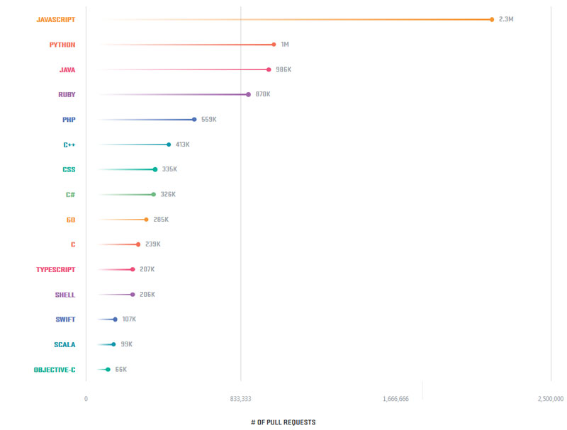

## Топ-5 фактов о GitHub

Итак, предоставляем вашему вниманию **Топ-5** фактов о ***GitHub***:

1. До ***GitHub*** у его сооснователей были провальные проекты.
 Например, социальная сеть **Farmspan** оказавшаясь финансовым провалом.
2. Сервис основан на ***Git*** — свободно доступной системой управления версиями софта, созданной *Линусом Торвальдсом* для совместной работы над кодом в **Linux**.
3. Самый популярный язык программирования на ***GitHub*** — это **JavaScript**. В январе 2012 года он обошел *Ruby, Java и Python,* и все еще удерживает первенство. Данные отчета за 2017 год:  

4. Сообщество разработчиков на ****GitHub*** на данный момент насчитывает 27 млн разработчиков по всему миру, они работают над 80 млн проектов. А первые 100 000 пользователей ***GitHub*** получил уже через год после старта — в июле 2009 года.
5. Среди самых популярных эмоджи на проекте — «палец вверх», за ней идут поздравительный символ и «сердечко».

Источник: [https://techrocks.ru](https://techrocks.ru/2018/04/13/10-facts-about-github/)

