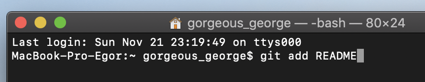

### git add

Команда ***git add*** добавляет содержимое рабочего каталога в индекс (**staging area**) для последующего коммита.

После **add** указывается файл, который хотим добавить под версионный контроль.

***

***
