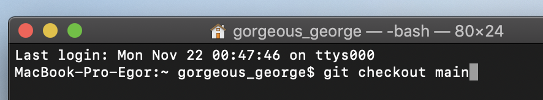

### git checkout

Команда ***git checkout*** позволяет перемещаться между ветками, созданными командой ***git branch***. При переключении ветки происходит обновление файлов в рабочем каталоге в соответствии с версией, хранящейся в этой ветке, а Git начинает записывать все новые коммиты в этой ветке.

***

***
