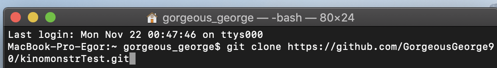

### git clone 

Для получения копии существующего **Git** -репозитория, например, проекта, в который вы хотите внести свой вклад, необходимо использовать команду ***git clone***.

При выполнении ***git clone*** с сервера забирается (*pulled*) каждая версия каждого файла из истории проекта.

***

***
