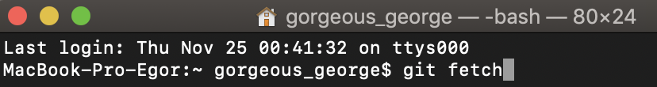

### git fetch

***

При использовании ***fetch***, **git** собирает все коммиты из целевой ветки, которых нет в текущей ветке, и сохраняет их в локальном репозитории. Однако он не сливает их в текущую ветку. Это особенно полезно, если вам нужно постоянно обновлять свой репозиторий.

***