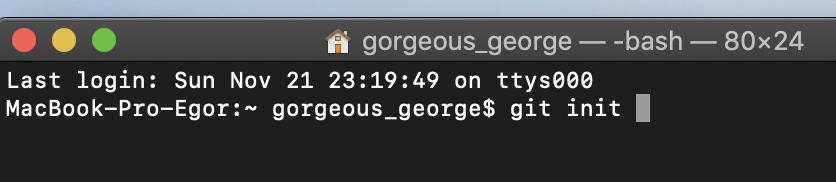

### git init

**Init**- это сокращение от **initialize** ( т.е. *инициализировать* или *включать*, *запускать*).

Команда ***git init***, запускает **Git** для данного *репозитория* (т.е. папки).

***

***
