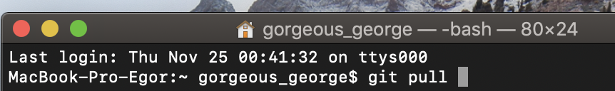

### git pull 

***

Команда ***git pull*** используется для извлечения и загрузки содержимого из удаленного репозитория и немедленного обновления локального репозитория этим содержимым.

Команда ***git pull*** на самом деле представляет собой комбинацию двух других команд: **git fetch** и **git merge.**

***