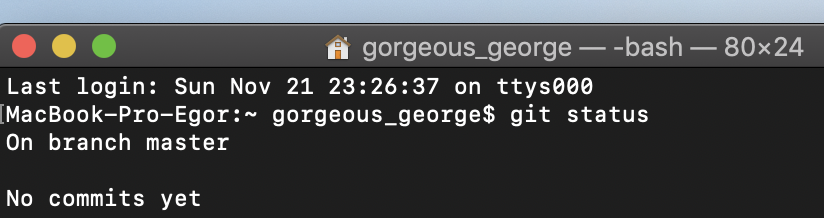

### git status

Команда ***git status*** отображает состояние рабочего каталога и раздела проиндексированных файлов. С ее помощью можно проверить индексацию изменений и увидеть файлы, которые не отслеживаются **Git**.

_ _ _

_ _ _
